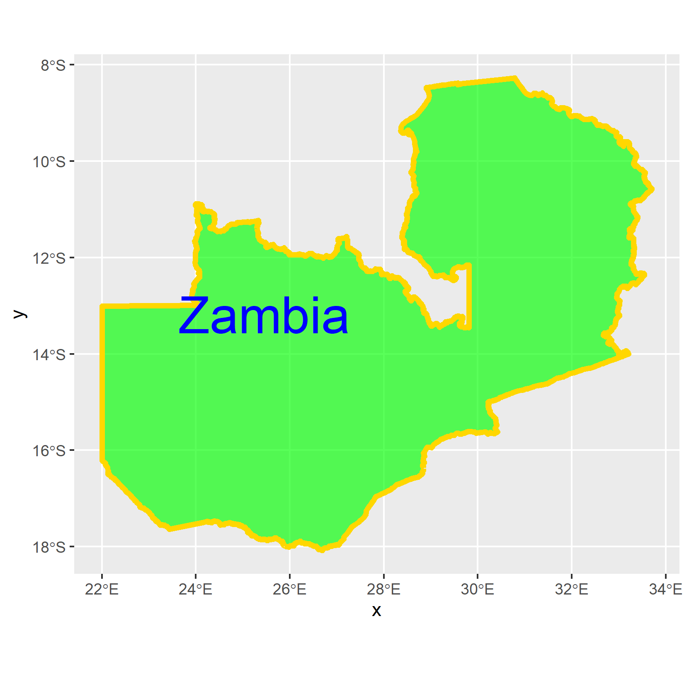
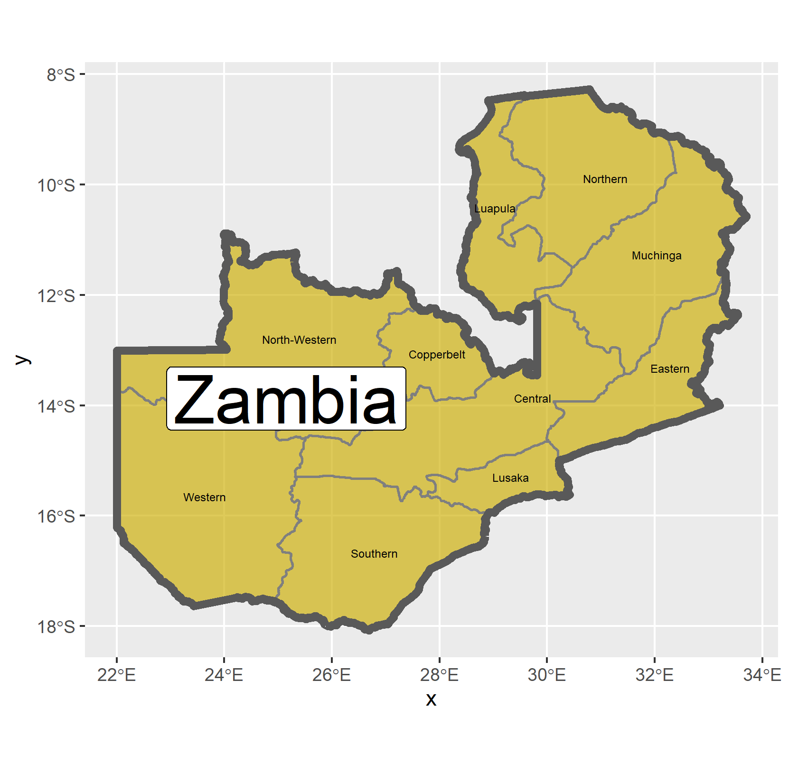
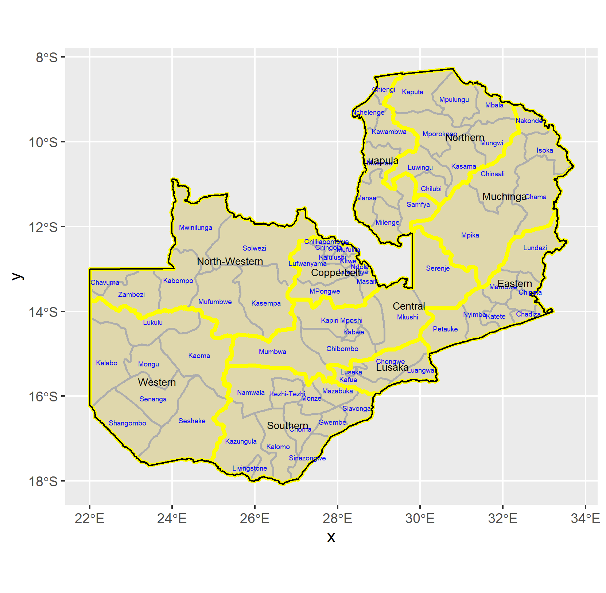

Zambia, in its outline:

Zambia, with basic interior province names:

Zambia, with more complexity, including main sub-territories:

*Individual Stretch Goal #1

Map of interior regions via W&M's GeoBoundaries lab (geoBoundaries v. 3.0.0', https://www.geoboundaries.org, Runfola D, Anderson A, Baier H, Crittenden M, Dowker E, Fuhrig S, et al. (2020) geoBoundaries: A global database of political administrative boundaries. PLoS ONE 15(4): e0231866. https://doi.org/10.1371/journal.pone.0231866.)

![]

Map of interior regions via Humanitarian Data Exchange (HDX) (United Nations Office for the Coordination of Human Affairs (OCHA) @https://data.humdata.org/dataset/zambia-administrative-boundaries-level-1-provinces-and-level-2-districts-with-census-2010-population)

![]

They are, in fact, different. The OCHA data internal boundaries are from a primary source, and seem much more detailed, real, and perhaps accurate. I would more closely trust the United Nations OCHA organization via humanitarian data. In that the United Nations may be closer to political realities in real time within Africa, in contradistinction to William & Mary's Geoboundaries project (a collection of sources), I would guess the above map better mirrors local political reality within Zambia.
